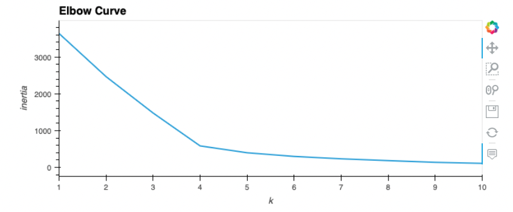
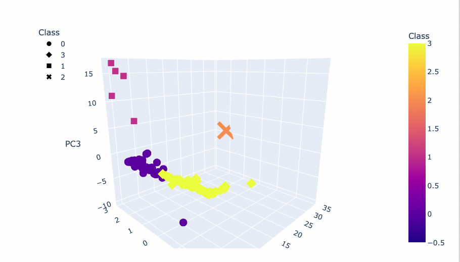

# Cryptocurrencies Overview

The purpose of this analysis was to apply unsupervised machine learning techniques to a data set of cryptocurrencies with various metrics for each.  Our customer is interested in offering portfolios of these currencies but aren't sure how they should be grouped.  Our results will be examined to determine what groups, if any, exist amongst these cryptocurrencies.

# Procedure and Results

### Preprocessing
To perfom the analysis, data is first imported to a data frame and then preprocessed for principle component analysis.
- Non trading currencies are removed from the data set
- Records with null values are dropped from the data set
- A dataframe is created to hold only relevant features
- get_dummies is applied to create variables for strings
- The data is scaled with StandardScaler

### PCA Analysis
The next step was to create three principal components from the scaled data and store the resutls in a dataframe.

### Clustering with K-Means
An elbow curve was created to find the best value K-Mean clusters.
- k values from 1 to 10 were considered
- The inertia was calculated for each k value and plotted as line graph

- Based on the graph aboe, the model was run using k=4
- Clusters are predicted from the model
- A dataframe is created with the coin informatino, PCA vectors and predicted clusters
- The dataframe is plotted as a 3d scatter

